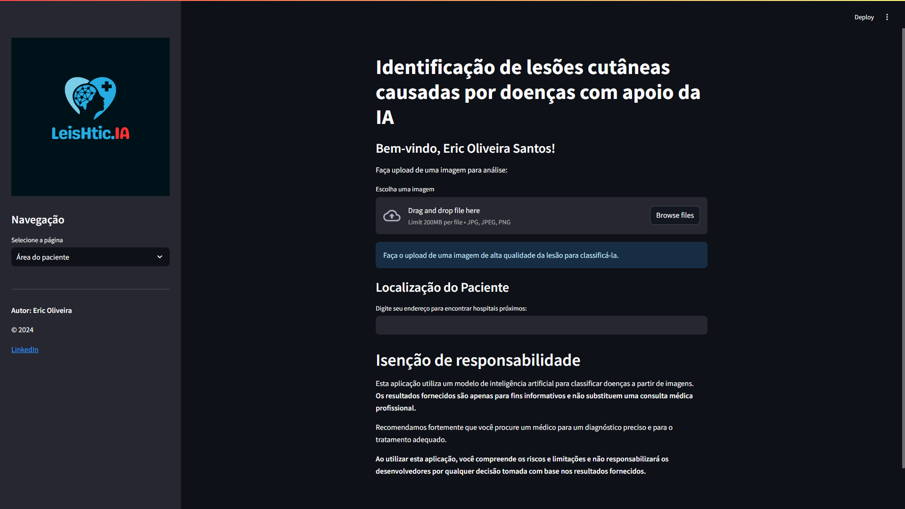
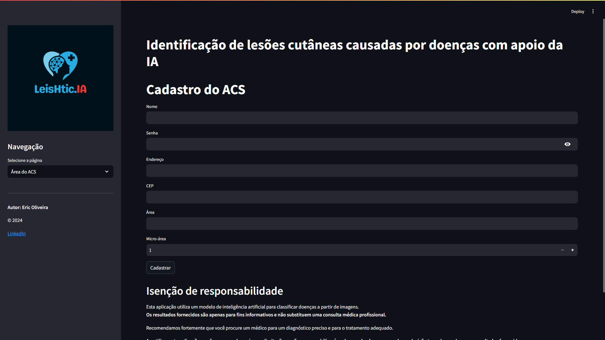
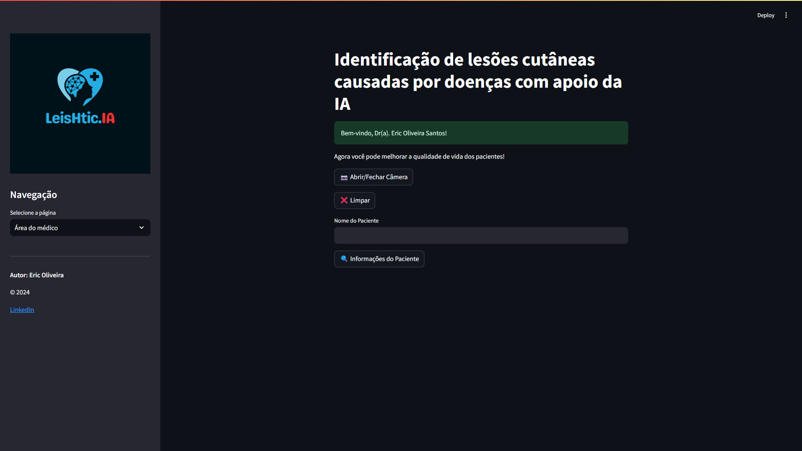
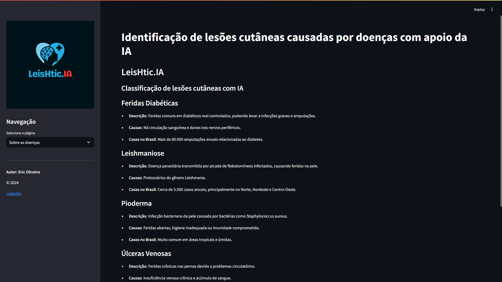

# LeisHtic.IA - AI-Assisted Skin Lesion Classification

## Overview
LeisHtic.IA is a research project that leverages artificial intelligence (AI) to classify skin lesion images associated with diseases such as **leishmaniasis, pyoderma, diabetes, venous ulcers, and carcinoma basocelular**. The goal is to assist in diagnosis and improve treatment efficiency.

## Gif Demo


## Features

### 1. Patient Area
- **Image Upload & Classification**: Patients can upload images of skin lesions, and the AI model will predict the disease category.
- **Patient Registration**: Secure storage of patient information.
- **Geolocation of Specialized Hospitals**: Uses Google Maps API to find nearby hospitals specialized in treating skin lesions.


### 2. Community Health Agent (ACS) Area
- **Patient Registration by ACS**: Agents can register new patients and upload lesion images.
- **Lesion Image Capture**: Direct image capture using a camera for real-time analysis.
- **SUS Verification**: Checks patient eligibility for public healthcare services.
- **Hospital Availability Check**: Finds the nearest available medical assistance.
- **Patient Referral**: Directs patients to the appropriate medical facilities.


### 3. Doctor Area
- **Patient Data Access**: Allows doctors to review patient information and lesion classification results.
- **Medical Diagnosis Support**: Provides additional insights for healthcare professionals based on AI predictions.


### 4. Skin Disease Information (Home Page)
- **Educational Content**: Descriptions, causes, and prevalence of classified diseases.


## Technologies Used
- **Deep Learning Model**: AlexNet (PyTorch) for image classification.
- **Framework**: Streamlit for web application development.
- **Database**: PostgreSQL for patient, acs and doctor data storage.
- **Image Processing**: OpenCV for image handling and preprocessing.
- **Google Maps API**: For hospital location services.

## Installation & Setup
```bash
# Clone the repository
git clone https://github.com/yourusername/LeisHticIA.git
cd LeisHticIA

# Create a virtual environment
python -m venv env
source env/bin/activate   # On Windows use: env\Scripts\activate

# Install dependencies
pip install -r requirements.txt

# Run the application
streamlit run app.py
```

## API Requirements
- Google Maps API requires **billing enabled** on your Google Cloud Project.
- Enable the following APIs:
  - **Geocoding API**
  - **Places API**
  - **Maps JavaScript API**
  
For more details, check [Google Maps API Setup](https://developers.google.com/maps/gmp-get-started).

## Disclaimer
This application uses an AI model for disease classification based on images. **Results are for informational purposes only and do not replace professional medical consultation.** Always seek a qualified healthcare provider for an accurate diagnosis and treatment.

## License
**© 2024 Eric Oliveira**
This project is licensed under the MIT License.

---

**Contributions are welcome!** Feel free to submit issues or pull requests to improve the project.
