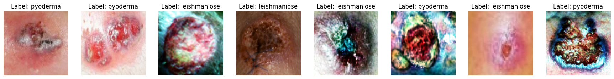
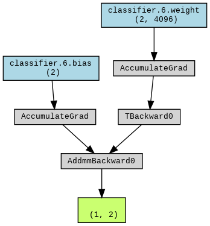
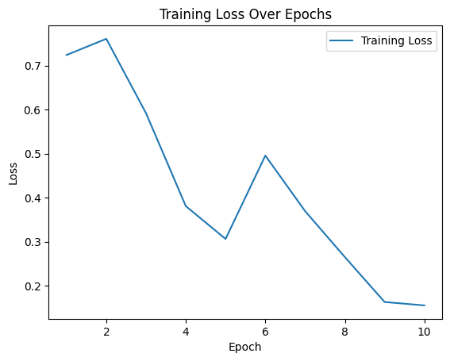
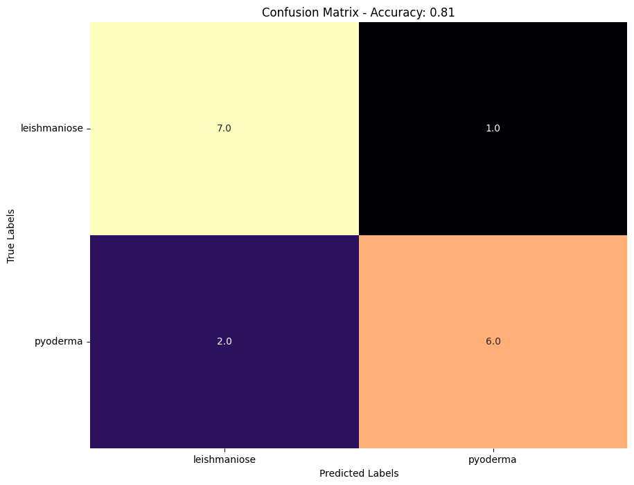
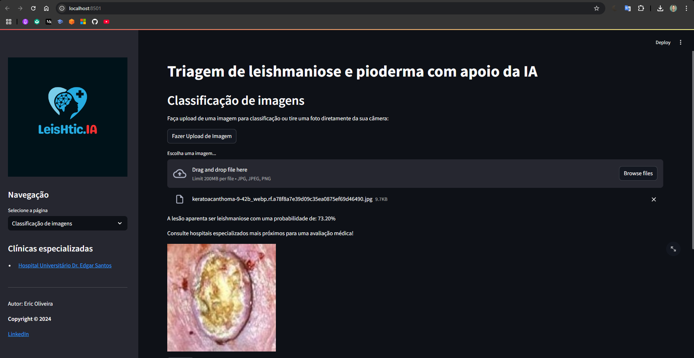

# LeisHtic.IA

LeisHtic.IA is a proof-of-concept (POC) artificial intelligence-based application designed to classify leishmaniasis and pyoderma lesions from images, aiding in the differential diagnosis of these skin conditions.

## About the Diseases

Leishmaniasis: A disease caused by Leishmania parasites and transmitted by sandfly bites. It can cause skin lesions or affect internal organs.
Pyoderma: A bacterial skin infection that produces pus and painful lesions, typically caused by Staphylococcus or Streptococcus bacteria.
Motivation
The project originated from the author’s experience with cutaneous leishmaniasis. The diagnosis was challenging, requiring over a year for visual confirmation by a specialized doctor. Leishmaniasis affects approximately 3,500 people per year in Brazil and shares characteristics with pyoderma, which led to developing a classifier that differentiates between these lesions.

## Methodology

### Scientific Research
This POC is based on research from three studies on lesion detection and classification using AI, including:

Deep learning model for cutaneous leishmaniasis detection and classification with YOLOv5.
Automated identification of cutaneous leishmaniasis lesions using AI.
Image processing for detecting local inflammation in cutaneous leishmaniasis.
Data Acquisition
The dataset includes 68 publicly sourced images from the internet, with 39 leishmaniasis and 29 pyoderma images.

## Model Development

- Model: Pre-trained AlexNet, adapted for binary classification between leishmaniasis and pyoderma.
- Data Transformations: Techniques like resizing, horizontal and vertical flips, brightness, and contrast adjustments were applied to enhance the training set’s variability.
- Model Evaluation:
The model was evaluated using metrics like recall, precision, F1-score, and a confusion matrix.

## Data and Transformations

Training data was enriched through transformations, including:

| Transformation      | Description                      |
|---------------------|----------------------------------|
| **Resizing**        | 224x224 pixels                   |
| **Flips**           | Horizontal and vertical flips    |
| **Brightness/Contrast** | Enhanced image variability    |

---

## Model Training

Training Data: 51 images (31 leishmaniasis, 21 pyoderma).
Architecture: AlexNet with convolutional layers for feature extraction, followed by dense layers with dropout for binary classification.
Binary Classification: Adapted to differentiate between leishmaniasis and pyoderma.

## Evaluation

### The model achieved:
High Precision: Accurate results on test images.
Results: 81.25% accuracy, with a minor error rate for leishmaniasis and pyoderma misclassifications.

## Software Development
The application was built using Streamlit, allowing users to upload lesion images or capture them via their device’s camera to obtain classification results.

## Conclusion

### Strengths
This study presents a pioneering solution to differentiate between leishmaniasis and pyoderma lesions, demonstrating high precision and specificity even with limited data. LeisHtic.IA shows potential for future development as a triage tool.

### Limitations
Due to the small dataset, the results lack statistical significance, and training adjustments were made without a validation set.

## Future Work

The project aims to expand the dataset by partnering with research institutions to strengthen the model and broaden the clinical applicability of LeisHtic.IA.

## References

- Anwar, M.; Khan, A.; Ahmed, R. "Image Processing for mHealth-Based Approach to Detect the Local Tissue Inflammation in Cutaneous Leishmaniasis: A Proof of Concept Study." Journal of Medical Imaging and Health Informatics, 2021.
- Rodriguez, J. A.; Gomez, E. A.; Perez, L. M. "Automated Identification of Cutaneous Leishmaniasis Lesions Using Deep-Learning-Based Artificial Intelligence." International Journal of Dermatology Research, 2022.
